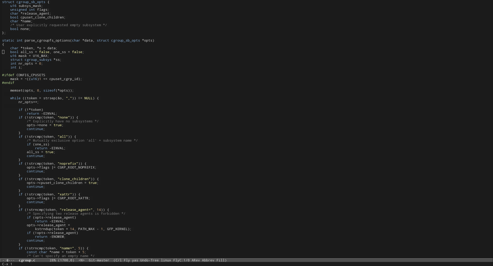

<p align="center">
  <a href="https://melpa.org/#/soria-theme"></a>
  <a href="https://stable.melpa.org/#/soria-theme"></a>
  <a href="https://travis-ci.org/mssola/soria" title="Travis CI status for the master branch"></a>
  <a href="http://www.gnu.org/licenses/gpl-3.0.txt" rel="nofollow"></a>
</p>

---

**Soria** is a color theme which mixes:

- [xoria256](http://www.vim.org/scripts/script.php?script_id=2140): a color
  theme by Dmitry Zotikov, originally for Vim. I did not do the initial porting
  from Vim to GNU Emacs, I took it from
  [suxue](https://github.com/suxue/xoria256-emacs).
- openSUSE: I took some colors from [openSUSE's Brand Guidelines](http://opensuse.github.io/branding-guidelines/).

In the `soria-theme.el` file I list further acknowledgements.

## Screenshots

I've saved some screenshots in the [screenshots](./screenshots) directory. They
do not show a full sample of all the defined colors, but it will give you a good
idea of the look and feel of this theme. A glimpse:



## Installation

### package.el (recommended)

This theme is available from [MELPA](https://melpa.org/#/soria-theme) and [MELPA
stable](https://stable.melpa.org/#/soria-theme). Thus, you can install this
theme like so:

`M-x package-install RET soria-theme`

To load it automatically on GNU Emacs startup add this to your init file:

```elisp
(load-theme 'soria t)
```

You can also use [use-package](https://github.com/jwiegley/use-package) for
this, with a configuration like:

```elisp
(use-package soria-theme
  :ensure t
  :config
  (load-theme 'soria t)

  (dolist (lang-hook '(ruby-mode-hook
                       php-mode-hook
                       perl-mode-hook
                       emacs-lisp-mode-hook))
    (add-hook lang-hook 'soria-theme-purple-identifiers)))
```

### Manual

Simply download the `soria-theme.el` file into your `~/.emacs.d/` and then load
it like so:

`M-x load-theme RET soria`

If you want to move this file into another directory, make sure that this
directory is inside of the `custom-theme-load-path` list. You can do this by
running the following lisp code:

```elisp
(add-to-list 'custom-theme-load-path "/home/user/my/themes/directory")
```

### openSUSE

I have also created a package inside of [my personal OBS
project](https://build.opensuse.org/package/show/home:mssola/soria-theme). You
can add the repository for your openSUSE distribution and install it like so:

```
# This is the openSUSE Leap 15.1 repository. Check my home project for more openSUSE distributions.
$ sudo zypper ar https://download.opensuse.org/repositories/home:/mssola/openSUSE_Leap_15.1/ home:mssola
$ sudo zypper ref home:mssola
$ sudo zypper install soria-theme
```

Note that this RPM installs the relevant file in
`/usr/share/emacs/site-lisp/themes`. You have to make sure that this directory
is inside of the `custom-theme-load-path` list. You can do this by running the
following lisp code:

```elisp
(add-to-list 'custom-theme-load-path "/usr/share/emacs/site-lisp/themes")
```

Then you can load this theme as usual:

`M-x load-theme RET soria`

## Customization

### soria-theme-hide-helm-header

This color theme defines the `soria` group, which in turn has only one
configuration option: `soria-theme-hide-helm-header`.

The Helm package in combination with Projectile shows a header that in my humble
opinion is quite useless and it's distracting. For this reason, this header is
hidden by default. If you set it to false, then you'll see the header with the
same colors as the status line.

### soria-theme-purple-identifiers

This theme also provides one interactive function that can be used as a hook:
`soria-theme-purple-identifiers`.

As a reminder, this color theme is a port from Vim, and Vim and GNU Emacs have
some different takes on function identifiers. As such, the original Vim theme
defines identifiers as purple, but only method definitions in Ruby, Perl and PHP
(languages that I've used with these theme, there might be more) were
highlighted this way, but that wasn't the case for C, C++ or Go. This is
certainly a bug in Vim, but I got used to it, and when doing this port I could
notice this a lot. For this reason, by default this color theme for GNU Emacs
defines function identifiers as white, but it provides this function so in other
languages can be drawn in purple.

You may turn identifiers into purple with a code like this:

```elisp
(dolist (lang-hook '(ruby-mode-hook
                     php-mode-hook
                     perl-mode-hook
                     emacs-lisp-mode-hook))
  (add-hook lang-hook 'soria-theme-purple-identifiers))
```

## Contributing

Do you want to contribute with code, or to report an issue you are facing? Read
the [CONTRIBUTING.org](./CONTRIBUTING.org) file.

## [Changelog](https://pbs.twimg.com/media/DJDYCcLXcAA_eIo?format=jpg&name=small)

Read the [CHANGELOG.org](./CHANGELOG.org) file.

## License

```
Copyright (C) 2016-2021 Miquel Sabaté Solà <mikisabate@gmail.com>

This program is free software: you can redistribute it and/or modify
it under the terms of the GNU General Public License as published by
the Free Software Foundation, either version 3 of the License, or
(at your option) any later version.

This program is distributed in the hope that it will be useful,
but WITHOUT ANY WARRANTY; without even the implied warranty of
MERCHANTABILITY or FITNESS FOR A PARTICULAR PURPOSE.  See the
GNU General Public License for more details.

You should have received a copy of the GNU General Public License
along with this program.  If not, see <http://www.gnu.org/licenses/>.
```
